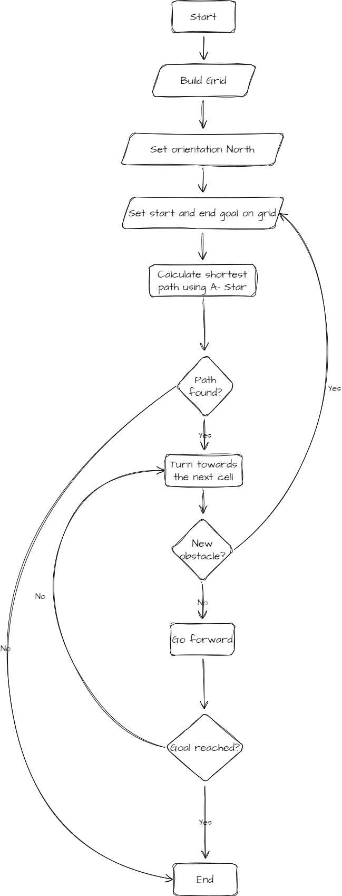
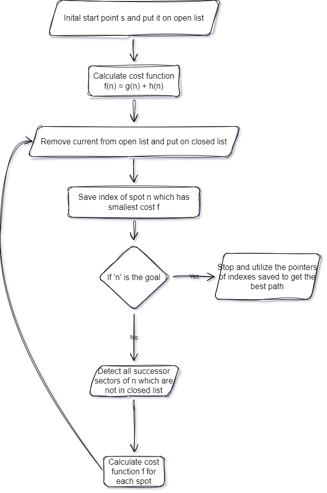

# Robotics course 2022

Team: Saffian Asghar, Alexis Culpin and Emilio Espinosa

Professors: Kevin Lhoste & Rajeev Mylapalli

This is the repository of the [LPI](https://www.learningplanetinstitute.org/en), [Dgital Master](https://master.learningplanetinstitute.org/en/digital) "Robotics" course 2022-2023 final projects.

# Mini project guide
Fork this repository and add your team members as collaborators to your fork. Make sure it is a public repository.

Use the following template to organise your files in your repository
 
    |_lib
        |_ schematics
            |_ components.md
        |_ resources
        |_ videos
        |_ images
        |_ algorithm.md
        |_ ideation.md

    |_src
    |_README.md

#### lib
It is your project library. Create shematics folder and add schema/circuit diagram/s of your mini project. Add components.md file to list all the components you are using.
#### resources 
It consists of all the resources like scientific articles, DIY blogs or tutorials you refered to. It is upto you if you want to maker a folder and add all the .pdf files or just make resources.md file and hyperlink all resources.
#### videos
In this folders upload a video of every stages of development of your project. if adding video is complex, make video.md file and add the link of the video that people can watch.
#### images
Incase if you have any images add them here.
#### algorithm.md
This is a very important file, where you explain your project general algorithm and also include the specifics of your approach to the path planning (usage of flowchart is highly recommended).
#### ideation.md
The ideation report you shared in the google classroom. Use [this](https://docs.google.com/document/d/1_CShynGTKjrCND__M2uXStj70VsBB-udfWfXpMz84Vs/edit) template.
#### src
This folder consists of your arduino or python code.

# Algorithm for Path Finding Robot

### Overall Path Finding Algorithm

Once we have the path in an array of coordinates, we need to use the path to move the robot around, and detect obstacle and recalculate the path

### A* Algorithm

The algorithm utilizes A star algorithm to find the best optimal path from point a to b using manhattan distance.

This finds the shortest path using heuristics on the given grid.

# Resources

The overall course [content](https://docs.google.com/presentation/d/1irOeB_RKd-NETgOlSd2deLiXENa9ExU59z8WiRyq_DI/edit#slide=id.gb895fb238d_0_475)

## Github guide
1. GIT [cheatsheet](https://education.github.com/git-cheat-sheet-education.pdf)
2. Getting started with github [Hello World](https://docs.github.com/en/get-started/quickstart/hello-world)
3. [Markdown Cheatsheet](https://github.com/adam-p/markdown-here/wiki/Markdown-Cheatsheet)

## Arduino
1. [Getting started](https://www.arduino.cc/en/Guide)
2. [Arduino software](https://www.arduino.cc/en/software)
3. Arduino for [Ubuntu](https://ubuntu.com/tutorials/install-the-arduino-ide#1-overview)
4. [Installing Libraries](https://docs.arduino.cc/software/ide-v1/tutorials/installing-libraries)
5. Tutorials from [Adafruit](https://learn.adafruit.com/series/learn-arduino)
6. Monk, Simon. Programming Arduino: Getting Started with Sketches. New York: McGraw-Hill Education, 2016.
7. Tutorial Series for Arduino by Jeremy Blum on youtube.

## Zumo
1. [User guide](https://www.pololu.com/docs/0J57)
2. [library](https://github.com/pololu/zumo-shield-arduino-library)

## Misc
1. [Basic concepts](https://www.electronics-notes.com/articles/basic_concepts/)
2. [A summary of electronics](https://electroagenda.com/en/a-summary-of-electronics/)
3. Millman, Jacob, and Christos C. Halkias. 1972. Integrated electronics: analog and digital circuits and systems. New York: McGraw-Hill. 
4. Thomas F. Schubert; Ernest M. Kim, Fundamentals of Electronics: Book 1 Electronic Devices and Circuit Applications , Morgan & Claypool, 2015.
