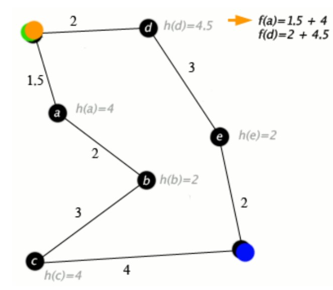
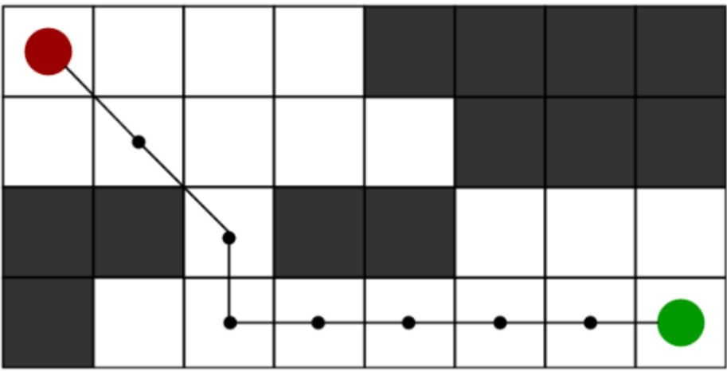

# Ideation Report

## Path finding Arduino with A*

## Team: Alexis Culpin, Saffian Asghar, Emilio Espinosa

## LPI project Link

## 1. Introduction : what do you want to do

```
● Build a path finder robot using A* algorithm. For this specific task, we will be using
Arduino Leonardo.
```
## 2. How you will solve this problem

```
● The components that will be used in this project:Arduino Leonardo, H-bridge, IR
sensors,breadboard,DCmotors,jumperwires,batteries(powersystem)andultrasonic
sensor.
● We will use theA* algorithm as itallows usto find the shortest path in real-life
scenarios.
```






## 3. Expected List of Features

```
● Our robot will be able to detect the shortest path from point A to point B while avoiding
obstacles.
● Our robot will be able to avoid surprise obstacles within the path and recalculate the
distance between point A and B.
```
## 4. List of equipment used

```
● Arduino Leonardo.
● H-bridge.
● 2 DC motors.
● 1 BreadBoard.
● 1 Ultrasonic sensor.
● AA2400mAh.
● 16 Jumping wires.
```
**5. Grid**

```
● 8 x 8
● 50 cm
```
## 6. References

```
● https://www.geeksforgeeks.org/a-search-algorithm/
● http://theory.stanford.edu/~amitp/GameProgramming/AStarComparison.html
● https://www.youtube.com/watch?v=-L-WgKMFuhE
```

