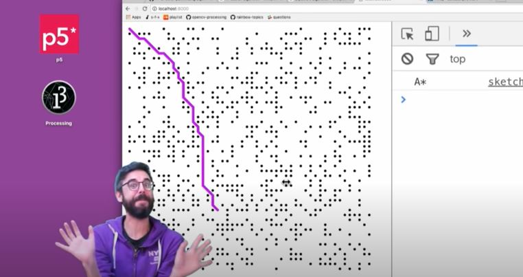
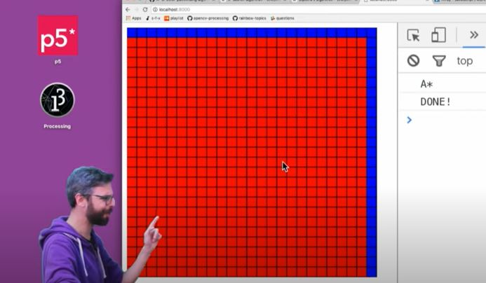

# Resources

The resources utilized to realize the Path Algorithm Project are:

### Resource 1: Wikipedia's A-Star Algorithm

https://en.wikipedia.org/wiki/A*_search_algorithm

### Resource 2: Zumo Robot Github

https://github.com/pololu/zumo-shield-arduino-library

### Resource 3: A* Pathfinding Algorithm - Part 1 

### Resource 4: A* Pathfinding Algorithm - Part 2

### Resource 5: Dijkstra’s Shortest Path Algorithm

